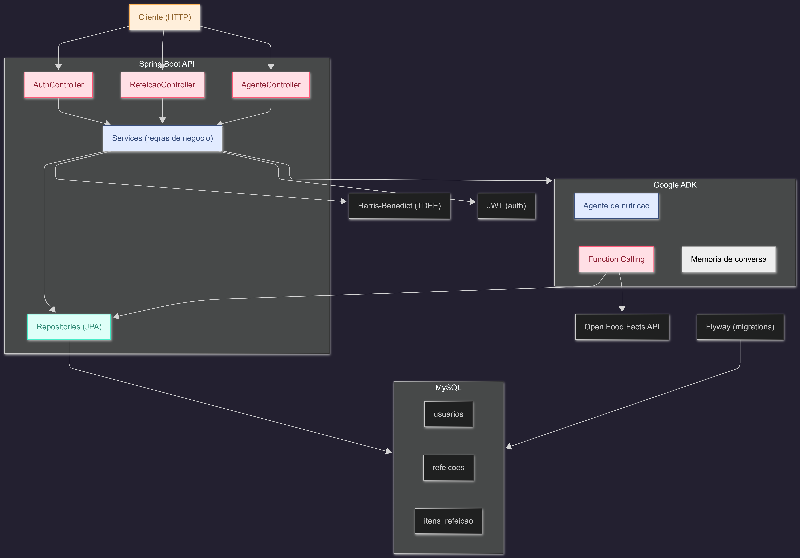
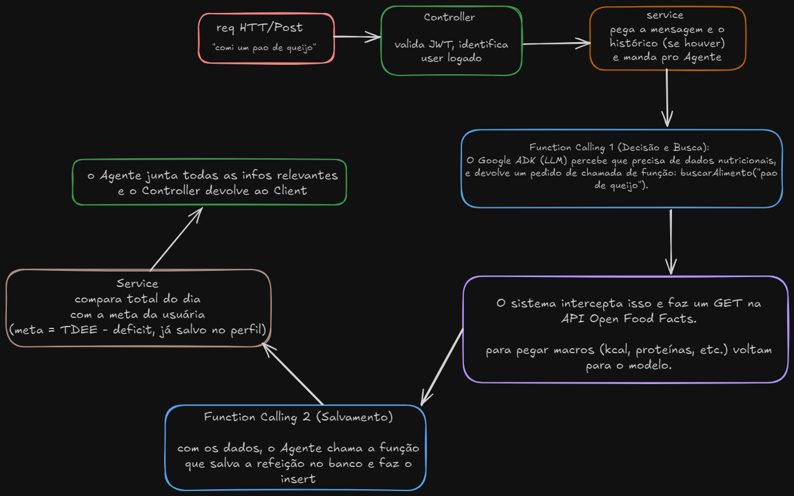

# Clean It

> App pessoal de acompanhamento calórico com agente de nutrição inteligente.

A usuária registra refeições em linguagem natural, recebe insights nutricionais e acompanha seu progresso de perda de peso — tudo via conversa com um agente que entende de nutrição.

---

## Stack

| Camada | Tecnologia |
|--------|-----------|
| Backend | Java 21 + Spring Boot 3.5 |
| Banco de dados | MySQL + Flyway |
| Agente | Google ADK com function calling |
| Dados nutricionais | Open Food Facts API |
| Cálculo de TDEE | Fórmula de Harris-Benedict |
| Autenticação | JWT |

---

## Arquitetura



---

## Exemplo do fluxo de uma conversa




---

## Endpoints planejados

### Auth
| Método | Rota | Descrição |
|--------|------|-----------|
| POST | `/auth/cadastro` | Cria conta com dados de perfil |
| POST | `/auth/login` | Retorna JWT |

### Usuário
| Método | Rota | Descrição |
|--------|------|-----------|
| GET | `/usuarios/perfil` | Retorna perfil e TDEE |
| PUT | `/usuarios/perfil` | Atualiza perfil e recalcula TDEE |

### Refeições
| Método | Rota | Descrição |
|--------|------|-----------|
| GET | `/refeicoes` | Histórico do dia |
| GET | `/progresso/semana` | Progresso dos últimos 7 dias |

### Agente
| Método | Rota | Descrição |
|--------|------|-----------|
| POST | `/agente/mensagem` | Envia mensagem e recebe resposta |

---

## Como rodar localmente

```bash
# clonar o repositorio
git clone https://github.com/yasmin-aline/clean-it.git
cd clean-it

# subir o banco com Docker
docker compose up -d

# rodar o projeto
./mvnw spring-boot:run
```

---

## Status

🌱 em desenvolvimento — projeto pessoal, sem prazo.
